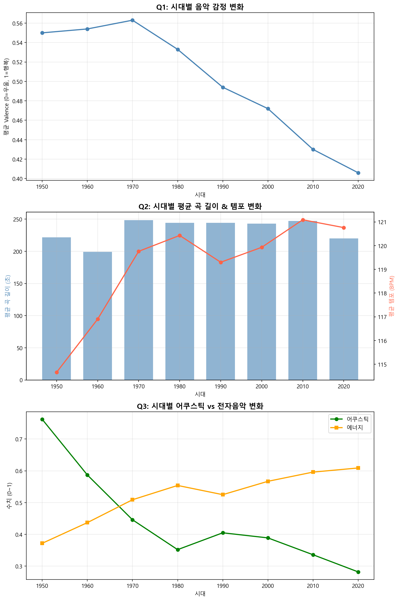

# music-bigdata-analysis

시대별 음악 메타데이터 변화를 분석하기 위한 빅데이터 처리 및 분석 프로젝트

# 분석 개요

이번 프로젝트는 다양한 시대의 노래를 듣다보니 느껴지는 차이점으로부터 발발된 질의로 시대가 지나면서 음악의 특징이 어떻게 달라졌는지 알아보고자 시작하였다. 음악은 단순히 듣기만 하는 콘텐츠가 아니라, 그 시대의 분위기나 동시대 사람들의 취향을 어느 정도 반영한다고 생각한다. 그래서 여러 시대의 음악 데이터를 모아 분석하면 특정 시기에 어떤 장르가 많이 등장했는지, 곡의 길이나 템포 같은 특징이 어떻게 변했는지 확인할 수 있을 것이라고 생각했다.

이를 위해 kaggle에서 제공하는 spotify 음악 메타데이터를 수집하고, hadoop 기반 환경을 활용하여 시대별 음악 특징의 변화를 분석하고자 하였다. 즉, 이번 프로젝트의 중추는 단순한 데이터 조회가 아닌 1950년대부터 2020년대까지의 음악이 감정적으로, 또는 형식적으로, 그리고 소리가 담아낸 음악의 성질이 어떻게 바뀌었는지를 데이터로 확인하는 것이다.

# 1. 분석 문제 정의
분석하기 전 효율적인 분석을 위하여 주요 분석 질문들을 만들어 보자면 하기 사항과 같다.
1. 시대별 음악의 감정은 당시 시대상·대중 분위기와 어떤 관계가 있는가?
2. 시대별 평균 곡 길이와 템포는 어떻게 변했는가?
3. 시대별로 어쿠스틱 음악은 줄고 전자음악은 늘었는가?

# 2. 사용 데이터

본 프로젝트에서는 Kaggle에서 제공하는 공개 음악 메타데이터를 사용하였다.

- 데이터셋: Spotify 1.2M Songs
- 출처: [Kaggle](https://www.kaggle.com/datasets/rodolfofigueroa/spotify-12m-songs)
- 형식: CSV
- 규모: 330MB, 약 120만 곡
- 수집 방법: Python 스크립트(download_data.py)를 통해 Kaggle API로 자동 수집

수집한 데이터는 HDFS에 업로드하여 분석에 사용하였다. 데이터의 크기가 크기 때문에 로컬 환경에서만 처리하지 않고, Hadoop 기반 환경에서 저장하고 처리하는 방식으로 진행하였다.

# 3. 기술 스택

| 단계 | 기술 | 역할 |
|---|---|---|
| 데이터 수집 | Python (Kaggle API) | 데이터 자동 다운로드 |
| 저장 | HDFS | 원본·처리·결과 데이터 저장 |
| 정제 | Apache Pig | 결측치 제거, 컬럼 선택, decade 컬럼 추가 |
| 분석 | Apache Spark / Spark SQL | 시대별 집계 및 통계 분석 |
| 시각화 | Matplotlib | 분석 결과 그래프 생성 |

# 4. 시스템 아키텍처
```
Kaggle 데이터 다운로드 (download_data.py)
        ↓
HDFS 적재 (/user/maria_dev/music/raw/)
        ↓  Pig: clean_music.pig
HDFS 정제 (/user/maria_dev/music/processed/)
        ↓  Spark: analyze_music.py
HDFS 결과 (/user/maria_dev/music/result/)
        ↓  Matplotlib: visualize.py
분석 결과 그래프 (music_analysis.png)
```

# 5. 데이터 처리 방법

## 1단계: 데이터 수집

Kaggle에서 제공하는 Spotify 1.2M Songs 데이터셋을 Python 스크립트(download_data.py)를 통해 자동 수집하였다. 수집된 데이터는 CSV 형식으로 약 120만 곡의 음악 메타데이터를 포함하며, 총 330MB 규모이다. 주요 컬럼은 다음과 같다.

- `name` : 곡 제목
- `artists` : 아티스트명
- `year` : 발매 연도
- `valence` : 음악 감정 긍정도 (0=우울, 1=행복)
- `tempo` : 템포 (BPM)
- `duration_ms` : 곡 길이 (밀리초)
- `acousticness` : 어쿠스틱 정도 (0~1)
- `energy` : 에너지 수준 (0~1)
- `loudness` : 음량 (dB)
- `danceability` : 댄서빌리티 (0~1)

## 2단계: HDFS 적재

수집한 CSV 파일을 HDFS의 `/user/maria_dev/music/raw/` 경로에 업로드하였다. 원본 데이터, 정제 데이터, 분석 결과를 각각 `raw/`, `processed/`, `result/` 디렉터리로 분리하여 관리하였다.

## 3단계: Pig 기반 데이터 정제

HDFS에 저장된 원본 CSV를 Pig로 불러와 다음과 같은 정제 작업을 수행하였다.

- **결측치 제거**: name, artists, year, tempo, duration_ms, acousticness, energy 컬럼에 null 값이 있는 레코드 제거
- **이상치 필터링**: year가 1900 이하이거나 2024 초과인 레코드, tempo가 0 이하인 레코드 제거
- **컬럼 선택**: 분석에 필요한 11개 컬럼만 추출
- **decade 컬럼 추가**: year를 10으로 나누어 시대 구간 컬럼 생성 (예: 1995 → 1990)
- **단위 변환**: duration_ms를 1000으로 나누어 초(sec) 단위로 변환

정제된 데이터는 HDFS의 `/user/maria_dev/music/processed/cleaned/` 경로에 저장하였다.

## 4단계: Spark 기반 분석

Pig로 정제된 데이터를 PySpark로 불러와 Spark SQL을 활용하여 3가지 분석 질문에 답하였다.

- **Q1 분석**: decade 기준으로 GROUP BY 후 valence, energy의 평균값 집계
- **Q2 분석**: decade 기준으로 GROUP BY 후 tempo, duration_sec의 평균값 및 표준편차 집계
- **Q3 분석**: decade 기준으로 GROUP BY 후 acousticness, energy의 평균값 집계 및 두 지표 간 변화 추이 비교

분석 결과는 HDFS의 `/user/maria_dev/music/result/` 경로에 CSV 형식으로 저장하였다.

## 5단계: 시각화

분석 결과 CSV를 로컬 환경으로 가져와 Matplotlib을 활용하여 시각화하였다.

- **Q1**: 시대별 valence 평균값 꺾은선 그래프
- **Q2**: 시대별 곡 길이(막대 그래프)와 템포(꺾은선 그래프)를 이중 축으로 표현
- **Q3**: 시대별 acousticness와 energy를 하나의 그래프에 겹쳐 두 지표의 교차 시점을 시각적으로 표현

# 6. 실행 방법

### 사전 준비
```bash
# Kaggle API 키 설정
mkdir -p ~/.kaggle
echo '{"username":"kaggle아이디","key":"kaggle키"}' > ~/.kaggle/kaggle.json
chmod 600 ~/.kaggle/kaggle.json

pip3 install kaggle --user
export PATH=$PATH:~/.local/bin
```

### 단계별 실행
```bash
# 1. 데이터 수집
python src/ingest/download_data.py

# 2. HDFS 업로드
hdfs dfs -mkdir -p /user/maria_dev/music/raw
hdfs dfs -put data/raw/tracks_features.csv /user/maria_dev/music/raw/

# 3. Pig 정제
pig -x mapreduce src/pipeline/clean_music.pig

# 4. Spark 분석
spark-submit src/pipeline/analyze_music.py

# 5. 결과 내보내기
hdfs dfs -getmerge /user/maria_dev/music/result/q1_valence result/q1_valence.csv
hdfs dfs -getmerge /user/maria_dev/music/result/q2_tempo_duration result/q2_tempo_duration.csv
hdfs dfs -getmerge /user/maria_dev/music/result/q3_acousticness result/q3_acousticness.csv

# 6. 시각화
python src/analyze/visualize.py
```

# 7. 분석 결과



### Q1. 시대별 음악 감정 변화
분석 결과, valence는 1970년대 0.563을 정점으로 이후 지속적으로 하락하여 2020년대에는 0.406까지 떨어졌다. 이는 시대가 지날수록 음악의 감정적 긍정도가 낮아졌음을 의미한다.

우선 데이터의 시작인 1950~1960년대는 valence가 0.55 내외로 비교적 밝고 긍정적인 음악이 주류를 이루었다. 또한 이 시기는 제2차 세계대전 이후 미국을 중심으로 한 국가들이 전후 복구와 산업화를 바탕으로 빠른 경제 성장을 이룬 시기였다. 이러한 경제 호황과 사회적 풍요의 낙관적 분위기가 당시 음악에도 그대로 반영되었다고 볼 수 있다. 게다가 대중매체의 발전으로 대중음악 시장이 급격히 성장하면서 로큰롤이 등장하고 비틀즈로 대표되는 팝 음악이 전 세계적으로 확산되는 등 급격히 불이 붙은 음악 시장 자체의 활기가 음악에서도 느껴졌다는 것을 알 수 있었다. 이렇게 1970년대에 잠시 최고점을 찍은 뒤, 1980년대부터 하락세가 시작되었는데 이는 펑크록, 헤비메탈 등 사회적 저항 의식을 담은 음악 장르가 등장한 시기와 맞물린다. 1990년대에는 너바나로 대표되는 그런지와 얼터너티브 록이 전성기를 맞으며 어둡고 내면적인 음악이 주류가 되었고, 이에 따라 valence도 0.494로 0.5 아래로 떨어졌다. 2010년대 이후에는 SNS의 확산으로 개인의 감정을 솔직하게 표현하는 음악 트렌드가 자리잡으면서 valence가 더욱 낮아진 것으로 해석된다.


### Q2. 시대별 곡 길이·템포 변화
곡 길이는 시대별로 비교적 뚜렷한 변화를 보였다. 1960년대에는 평균 199초로 가장 짧았는데, 이는 당시 라디오 방송 중심의 음악 소비 환경에서 짧고 간결한 곡이 선호되었기 때문으로 볼 수 있다. 이후 1970년대에는 248초로 급격히 늘어났는데, 이 시기는 LP 앨범 문화가 자리잡고 프로그레시브 록 등 긴 러닝타임의 음악이 유행하던 때였다. 2000년대 이후에는 242~247초로 비슷한 수준을 유지하다가 2020년대에 219초로 다시 감소하였다. 이는 스트리밍 서비스가 보편화되고 짧은 영상 콘텐츠 소비가 늘어난 환경에서 짧고 임팩트 있는 곡이 선호되는 트렌드를 반영한 것으로 보인다.
템포는 1950년대 114.66 BPM에서 시작하여 이후 119~121 BPM 범위에서 비교적 안정적으로 유지되었다. 시대가 바뀌어도 대중이 선호하는 음악의 속도는 크게 변하지 않았음을 알 수 있다.

### Q3. acousticness와 energy의 상관관계
acousticness와 energy는 서로 반대 방향으로 움직이는 뚜렷한 음의 상관관계를 보였다. acousticness는 1950년대 0.762에서 2020년대 0.282로 크게 감소한 반면, energy는 같은 기간 0.372에서 0.609로 꾸준히 상승하였다.
특히 주목할 만한 점은 두 지표가 1970년대에 교차한다는 것이다. 이 시기는 신시사이저와 전기 기타가 대중음악에 본격적으로 도입되고, 디스코와 록 음악이 전성기를 맞던 때로, 어쿠스틱 중심에서 전자음악 중심으로 음악의 성격이 전환된 시점으로 해석할 수 있다. 이후 1980년대 전자음악의 대중화, 1990년대 EDM의 등장을 거치면서 이 경향은 더욱 강화되었고, 2020년대에는 어쿠스틱 음악의 비율이 크게 줄어든 반면 에너지 수준은 역대 최고 수준에 도달하였다.

# 8. 참고 자료
- 데이터: [Spotify 1.2M Songs](https://www.kaggle.com/datasets/rodolfofigueroa/spotify-12m-songs)
- Apache Pig: https://pig.apache.org/
- Apache Spark: https://spark.apache.org/


